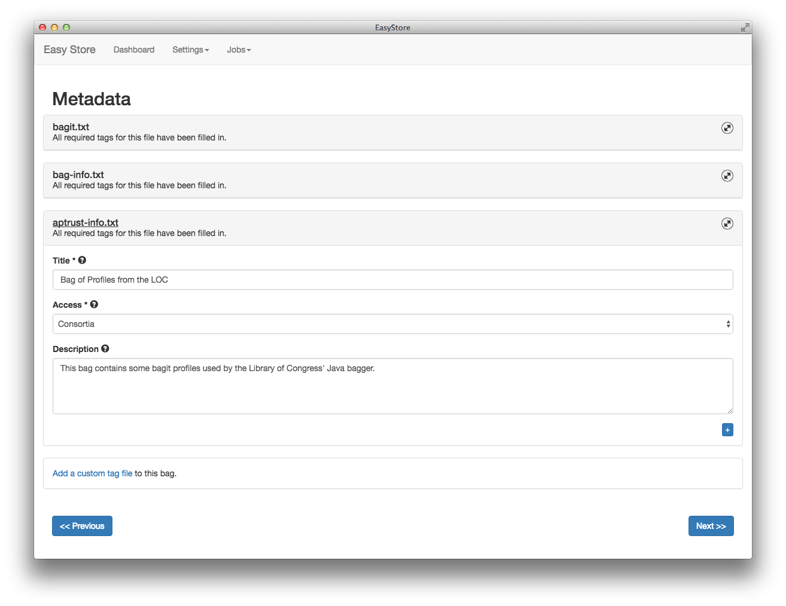
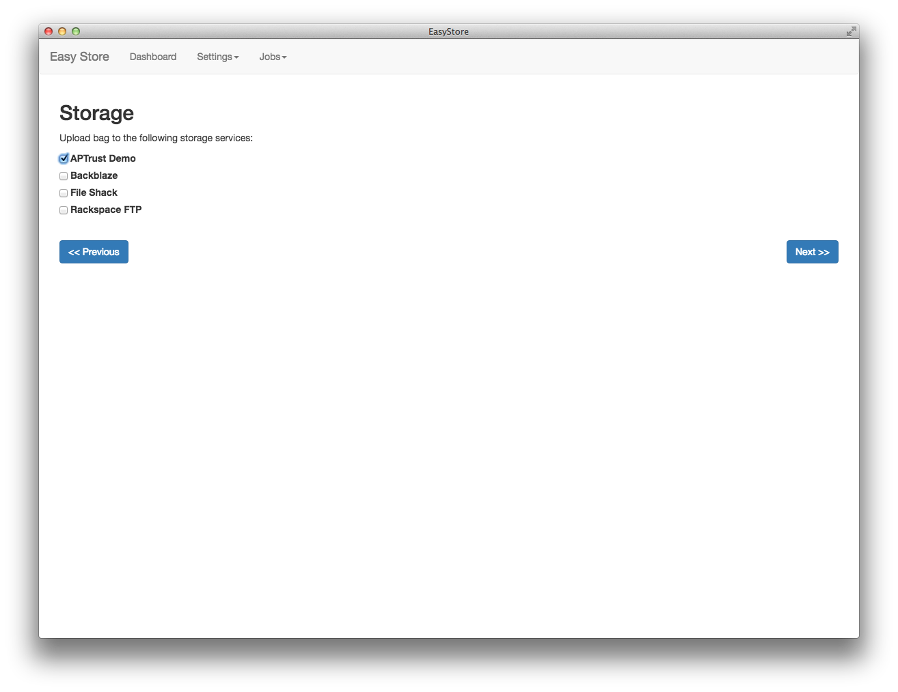

# APTrust Easy Store

Easy Store will provide a simple way of creating BagIt files and shipping them
off to various back ends.

# Screenshots

Easy Store has a five-step process for packing and shipping bags.

1. Drag and drop the files and folders you want to bag.

2. Choose your packaging format. Easy Store supports APTrust and DPN BagIt profiles out of the box, and you can easily define new formats to suit your organization's needs.

3. Add the metadata you want to save with your bag. Easy Store lets you define default values, so you don't have to repeatedly enter common data for each bag.

4. Choose a location to deliver your bags. The software can currently upload to any S3-compatible service, and will add other protocols life FTP in the future.

5. Review and run your job. Easy Store will package and validate the bag, then copy it to the remote location.

You can define multiple BagIt formats, default metadata values, and multiple storage backends through a simple UI.

The underlying bagging software can be scripted using Ruby, Python, JavaScript, PHP, or any other language that can generate JSON and call external programs.

Easy Store is open source and its service layer is composed of plugins, making it easy to add support for new packaging formats (tar, zip, rar, etc.) and network protocols (ftp, sftp, rsync, etc.).

Easy Store is built on Electron and can run on Windows, Mac, and Linux. We are nearing a beta release in early 2018.

# Goals

This project aims to provide the following:

## Bagging

* Configurable bag creation and validation through the use of BagIt profiles.
* Stand-alone tools for building and validating bags that require no external
libraries. Each tool is a stand-alone executable binary.
* Multi-platform support, including Linux, Mac, and Windows.
* A simple, scriptable command-line interface.
* A simple, intuitive UI for drag-and-drop bagging.
* Reasonable peformance, even when creating and validating large bags that
include tens of thousands of files.

## Shipping

* A simple UI for sending bags (or other files) to remote storage. The
initial focus will be on object stores that support an S3-compliant API.
* Simple command-line tools for storing objects.

## Workflows

* An intuitive UI to define workflows that describe how items should be
bagged and where they should be shipped.
* The ability to push items through a workflow from the UI, or via scripting.

# Running the UI on Your Dev Machine

1. Install the latest [Node.js](https://nodejs.org/en/download/), which includes npm,
   the Node Package Manager.
2. Install Electron using a [Mac or Windows installer](https://electronjs.org/releases),
   or if you're running linux, [install electron using npm](https://www.npmjs.com/package/electron).
3. Clone this repository, if you haven't already.
4. At the command line, cd into this repository's top-level directory
5. Run the script [electron/run.rb](electron/run.rb).

# APTrust BagIt

This is the APTrust library for creating and validating bags that conform to
explicit BagIt profiles. The profiles are similar to those in the
bagit-profiles project at https://github.com/ruebot/bagit-profiles. The major
difference between these profiles and ruebot's is that these provide broader
support for required tags in specific tag files other than bag-info.txt.

# Current Status and Roadmap (Updated March 20, 2018)

New APTrust depositors are already using early alpha versions to push materials into
our production repositories. As of March, 2018, the following features are working:

1. Creating bags that conform to the APTrust BagIt spec by simply dragging and dropping files.
2. Uploading bags to APTrust's S3 receiving buckets.

Immediate items on the roadmap, in order of importance:

1. Code cleanup and refactoring. The existing code is messy and does not adequately
separate concerns. Model classes should be separate from forms, and UI code should be
separate from models and forms. Cleanup and refactoring will give us a stable codebase
that others can contribute to.
2. Integration with APTrust's REST API. At the moment, this requirement has higher
priority than formal testing because users need to see the full outcome of the
pack-ship-ingest process.
3. Formal unit and integration tests. This depends on completion of #1 above.

Additional tasks, in no particular order:

* Add workflows, so a user can say, "These are the files, here's the essential bag
metadata, now pack it and ship it in the usual way."
* Formalize plugin interfaces, so other developers can contribute plugins.
* Finish automated build, deployment, and auto-updating features, so the app can keep
itself up to date without user intervention.
* Separate the JavaScript and Go code into distinct repositories. The current
builds don't use the Go code at all.

And...

Change the name from EasyStore to DART. Digital Artifact Routing Tool. It's more
generic and doesn't have the unfortunate connotation of equating storage with
preservation. DART is primarily intending for packing and shipping digital materials.
It's not a full preservation solution. It just eases the process of creating and
delivering the SIP so you can actually use your digital preservation solution.
