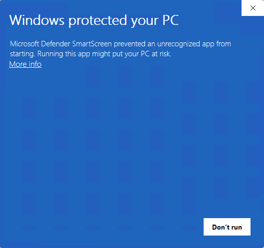
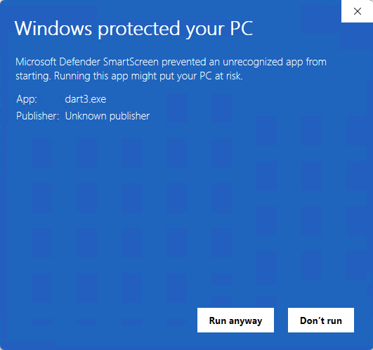
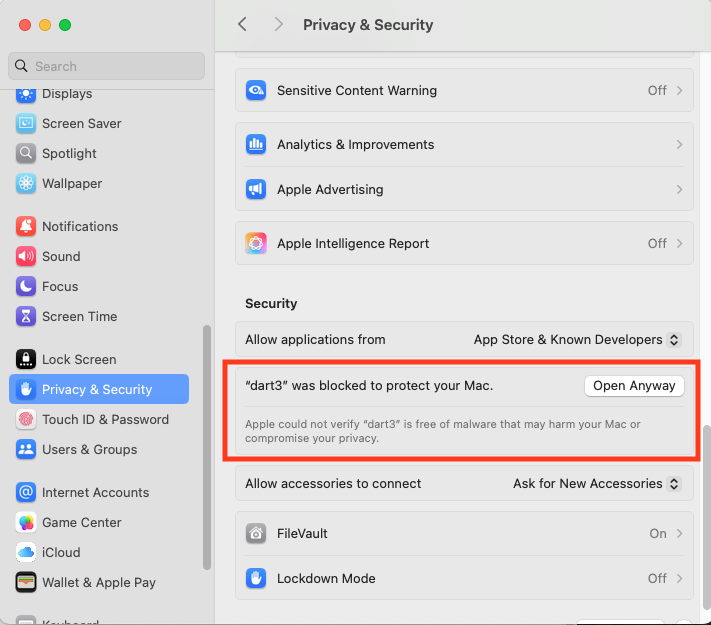
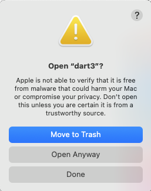
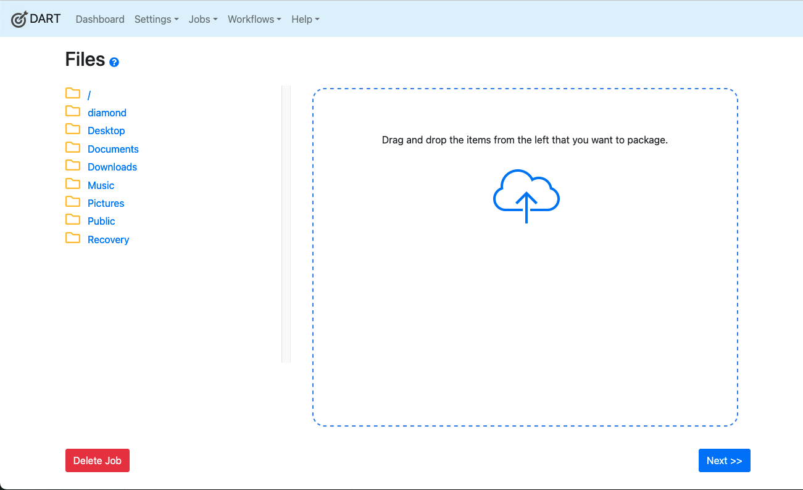

# DART 3

DART 3 is currently in ALPHA mode. We encourage you to use it for testing and to report bugs and feature requests at https://github.com/APTrust/dart/issues.

DO NOT USE THE ALPHA VERSION FOR ESSENTIAL PRODUCTION WORKFLOWS! Wait for a stable release build if you want to use this in production.

## Getting Started

1. Dowloading the App

| Operating System       | Download Link |
| ---------------------- | ------------- |
| Windows (Intel 64-bit) | https://s3.us-east-1.amazonaws.com/aptrust.public.download/dart3/alpha-03/windows-amd64/dart3-alpha-03.exe |
| Mac (Any CPU)          | https://s3.us-east-1.amazonaws.com/aptrust.public.download/dart3/alpha-03/mac-universal/DART.zip |
| Linux (Intel 64-bit)   | https://s3.us-east-1.amazonaws.com/aptrust.public.download/dart3/alpha-03/linux-amd64/dart3-alpha-03 |

2. Follow the instructions below to start the app on your operating system.

### Starting DART 3 on Windows

1. Double click on dart3.

2. You'll see a message saying Windows protected your computer by refusing to run the app.



3. Click the **More info** link. You'll see the following message:



4. Click **Run Anyway**. You should see a new browser tab showing DART 3.


### Starting DART 3 on MacOS

We have not yet implemented code signing for the MacOS version of DART 3, so you'll have to go through some extra steps to open the app.

1. Unzip DART 3 and make it executable. If you downloaded DART into your Downloads folder, the open a terminal (aka terminal.app) and type the following:

```
cd ~/Downloads
unzip DART.zip
chmod 0755 DART.app
xattr -d com.apple.quarantine DART.app
```

2. Hold down the Control key while you click on the DART 3 app. You'll see a message saying Mac won't open the app because it's hasn't been signed or is from an untrusted developer.

3. Go to the Apple menu in the upper left corner of the screen and select **System Settings**.

4. Scroll down to **Privacy & Security**, then click **Open Anyway** next to the message saying DART 3 was blocked.



5. When asked to open DART 3, click **Open Anyway.**



6. Enter your password at the system prompt.

We will be working on code signing before the final release to all DART 3 to launch without all these hoops.

### Starting DART 3 on Linux

1. First, make DART 3 executable. If you downloaded DART into your Downloads folder, the open a terminal (aka terminal.app) and type the following:

```
cd ~/Downloads
chmod 0755 dart3
```

2. Double-click on **dart3** in your file browser, or simply run `./dart3` in your terminal, and you'll see a new browser tab open with DART 3 running.


## Known Issues

Major features are generally known to work in the current alpha build. However, the build has some known issues, including:

* Trying to package in any format other than BagIt may cause errors.
* The About window currently does not show the version number in the dart3-alpha-02 build.

## Notable UI Changes

For the most part, DART 3 looks like DART 2. The one notable change is that DART 2 let you drag in files from the desktop to be bagged. In DART 3, the file browser is inside the application, to the left of the drop zone, as in the image below.



Click any folder to open it. Drag a file into the drop zone to include it in the bag. Drag a folder into the drop zone to include the whole folder in the bag.

## Feature Comparison

DART 3 supports all DART 2 features, plus:

  * gzipped bags
  * unserialized bags
  * local preservation of artifacts such as tag files and manifests

Here's a more complete comparison. We will update this list as necessary with each new alpha release of DART 3.

**Last Updated: March 12, 2024**

 **Feature**                                    | **DART 2**   | **DART 3**   | **Notes**
------------------------------------------------|--------------|--------------|-------------------------------------------------------------------------------------------
 **Dashboard - Show Recent Jobs**               | Yes          | Yes          |
 **Dashboard - Show Recent APTrust Work Items** | Yes          | Yes          |
 **View/Edit Application Settings**             | Yes          | Yes          |
 **Import BagIt Profiles**                      | Yes          | Yes          |
 **Export BagIt Profiles**                      | Yes          | Yes          |
 **Edit/Customize BagIt Profiles**              | Yes          | Yes          |
 **Remote Repositories**                        | APTrust only | APTrust only |
 **S3 Storage Services**                        | Yes          | Yes          |
 **SFTP Storage Services with password**        | Yes          | Yes          |
 **SFTP Storage Services with SSH key**         | Yes          | Yes          |
 **Export Settings**                            | Yes          | Yes          |
 **Import Settings**                            | Yes          | Yes          |
 **Run Bagging Jobs**                           | Yes          | Yes          |
 **Create tarred bags**                         | Yes          | Yes          |
 **Create loose bags**                          | No           | Yes          |
 **Create gzipped bags**                        | No           | Yes          | Currently only supports .tar.gz bags.
 **Run Validation-only Jobs**                   | Yes          | Yes          |
 **Validate tarred bags**                       | Yes          | Yes          |
 **Validate loose bags**                        | No           | Yes          |
 **Validate gzipped bats**                      | No           | Yes          |
 **Run upload-only jobs**                       | No           | No           |
 **Save artifacts after job runs**              | No           | Yes          | Includes job description, job result, tag files and manifests.
 **Create Workflows**                           | Yes          | Yes          |
 **Run one-off workflow jobs**                  | Yes          | Yes          |
 **Run workflow batch jobs**                    | Yes          | Yes          |
 **Help Link**                                  | Yes          | Yes          |
 **Context-sensitive help links**               | No           | No           | Coming soon.
 **View log files**                             | Yes          | Yes          | Log rotation caused problems with log viewing in DART 2. Fixed in DART 3.
 **Choose how to deal with illegal characters** | No           | Yes          | Choose how DART should deal with illegal filename characters when bagging and validating.


## Platform Rationale

DART 3 will be the successor to DART 2. DART 2 is an Electron app that whose maintenance has been time consuming and difficult. We chose to write DART 3 in Go as a locally-running web app for a number of reasons, including:

* The tasks DART has to perform can be written much more clearly in Go than in JavaScript. This substantially eases our maintenance burden and makes it easier to add new features. Node's default async model is particularly ill-suited to some of DART's core tasks. (E.g. writing tar files, which MUST be done synchronously.)
* The Go ecosystem is more stable than the Electron/Node ecosystem. We know this from years of maintaining code on both platforms.
* Node and Electron often introduce breaking features in new releases, forcing us to abandon and rewrite working code. The Go language and the major browsers rarely do this.
* The rest of the APTrust ecosystem is written in Go, which allows us to reuse proven code for bagging, validation and file transport. This substantially reduces the burden of having to maintain complex code in two different languages (Go and JavaScript) with identical functionality and behavior.
* Electron apps like DART use substantial resources. Running the DART test suite consumed about 1.5 GB of RAM. DART 3 uses about 14 MB of RAM and considerably less CPU.
* Electron builds did not always behave the same way as Electron in the development environment. Spending days of developer time to debug these issues was a poor use of developer time.
* DART 3 now shares a lot of code with Dart Runner, which ensures more consistent behavior between the two apps.
* The use of Go in DART 3 will eventually allow us to share core code between preservation services, DART, Dart Runner and the [apt-cmd](https://github.com/APTrust/apt-cmd) suite of command-line tools.

We evaluated a number of platforms similar to Electron that would allow us to use Go instead of JavaScript for the heavy work. The most promising of these was [Wails](https://wails.io/), but in our early tests in 2022, we experienced some crashes and blank screens, and we didn't feel the platform was mature enough.

We decided to go with the simplest and most reliable technologies available, where are a basic web server and whichever browser the user prefers.

## Separation of Policy and Implementation

At this point, the DART UI is essentially a policy editor. Its job is to help the user construct a valid description of a job: what is to be packaged, what BagIt profile to use, what metadata to add, and where to send it. Once that description is created, DART serializes it to JSON and passes it off to DART Runner to do the work. DART Runner is the worker that implements the policy.

DART Runner has been in use for several years. We created it to run unattended jobs on servers that had no graphics or windowing system, only a command line. The traditional use case was that a user would create a workflow interactively in DART, then export that workflow to JSON. They would then create a CSV file listing directories to bag up, and they'd tell DART Runner to run everything in the CSV file through the workflow described by the JSON file.

This has worked well in practice for the few people using it. Some users have kicked off bag-and-upload jobs of dozens of terabytes that take weeks to run. It all runs unattended leaving the user is free to work on other things.

While we were maintaining DART 2, we effectively had one policy editor (the DART GUI) and two full implementations of the worker. The DART 2 implementation was written in JavaScript and DART Runner was written in Go. The two worked equally well for bags up to a few gigabytes, but DART Runner worked better for larger bags, particularly in the upload phase, where DART 2 would often stall.

DART 3 brings us down to one policy editor and one implementor, all written in the same language.

## Security Notes

Because DART 3 exposes the local file system in the browser, it listens only on 127.0.0.1, which means it will not accept outside connections.

## DART 3 on the Server

In future, we may offer a "server mode" for DART 3, allowing organizations to run the app on a shared server accessible to selected staff. In that case, it will be up to the host organization to secure the DART 3 instance.

Server-hosted DART could have a number of advantages. If hosted on a server attached to shared drives, any DART user could bag and upload items from any of the shares. For long-running jobs, such as bagging and uploading multi-terabyte packages, users could kick off jobs that won't tie up their own workstations. Large jobs and workflows could run in the background for days while users attend to other tasks.

## Prerequisites for Development

* Go > 1.23
* Ruby > 2.0 (to run build and test scripts) - ** We should convert this to bash **
* Docker (to run Minio and SFTP containers)

## Notes for Developers

Testing: `./scripts/run.rb tests`

Building for realease: `./scripts/build_dart.rb`

Running in dev mode: `./scripts/run.rb dart`

Note that running in dev mode also starts a local SFTP server and a Minio server, both in docker containers. DART will print the URLs and credentials for these local services in the console so you can look into them if necessary.

Also, if you want to run DART 3 through the VS Code debugger and have it upload to local S3 and SFTP servers, use this:

`./scripts/run.rb services`

Then start DART 3 in debug mode in VS Code. From there, you can use DART through http://localhost:8444.

Also, not that a number of tests call util.ProjectRoot(), which actually comes from Dart Runner's util code and points to Dart Runner's project root. If you have installed the Dart Runner dependency (which is listed in go.mod and **should**) be installed automatically by Go, then util.ProjectRoot() will point to the root directory of your local copy of Dart Runner.

## Building for Release

1. Run the build script from the project's top-level directory: `./scripts/build_dart.sh`
2. On Mac, run the signing script from the top-level directory: `./scripts/mac_sign_and_notarize.sh`

If you're code-signing on Mac, be sure you have a signing certificate and that you have created a local file called codesign.env that is based on [codesign_example.env](codesign_example.env). Note that that file includes instructions on how to set up Mac code signing. If you have trouble running the code signing process on Mac, run `./scripts/diagnose_cert_file.sh` for diagnostics.

Since we're in very early alpha phase, we don't have a formal release process yet. For now, we build the app as decribed above and then manually copy it to our S3 public download bucket. Updates to the release notes are also done manually.

For more on Wails build options, see https://wails.io/docs/guides/manual-builds/. Also note that the build system (and many other things) will be changing in Wails 3. See https://v3alpha.wails.io/whats-new/ for details.

At the moment, we need to build the Wails app on each platform and architecture separately. This means we build Windows amd64 on a Windows amd64 machine, Linux amd64 on a Linux amd64 box, etc. Once we have CI/CD set up in GitLab, we should be able to do cross-platform builds using a method like the one described here: https://wails.io/docs/guides/crossplatform-build/

We are currently not code-signing Windows builds because the process of obtaining a Windows signing certificate is prohibitive.

# Note on Wails

Wails build is currently working in dart3-wails branch, but Wails drag-and-drop is broken, so we're currently using our own drag-and-drop implementation.

See these open Wails issues:
  * https://github.com/wailsapp/wails/issues/3563
  * https://github.com/wailsapp/wails/pull/3949

Some Wails code is currently commented out in these files:

  * server/views/job/files.html
  * server/views/partials/page_header.html

## Live Development

To run in live development mode, run `wails dev` in the project directory. This will run a Vite development
server that will provide very fast hot reload of your frontend changes. If you want to develop in a browser
and have access to your Go methods, there is also a dev server that runs on http://localhost:34115. Connect
to this in your browser, and you can call your Go code from devtools.

## Debugging

To debug with VS Code:

1. Click the Debug icon in VS Code's left nav.
2. Select "Launch Package" from the list in the upper left corner beside the words Run and Debug.
3. Click the green Start Debugging arrow.
4. Go to http://localhost:8444 (a browser window should open automatically with that URL).

Now you can set breakpoints in the code.

Also, use `./scripts/run.rb services` to run local SFTP and S3 services during DART debugging.

## Working with Dart Runner

DART 3 relies on Dart Runner to package and ship bags. Often, when fixing items in DART,
you'll actually be fixing items in Dart Runner. The easiest way to do this is to add the
following to go.mod, so it points to your local Dart Runner source code repo. This prevents
you having to push code to Dart Runner and then pull it back down into DART.

```
# In go.mod

// Uncomment this to use local version of dart-runner instead of
// GitHub version. This makes development much quicker, as you
// can instantly pick up changes to dart runner. It's also less
// messy that git submodules.

replace github.com/APTrust/dart-runner => ../dart-runner

require (
	~~github.com/APTrust/dart-runner v0.0.0-20251011144618-6e22996d0b69~~
	github.com/gin-gonic/gin v1.10.0
	github.com/google/uuid v1.6.0
	github.com/stretchr/testify v1.10.0
	github.com/wailsapp/wails/v2 v2.10.2
)
```

This code replaces Dart Runner from github.com with Dart Runner on the local file system,
assuming that Dart Runner is one level up the file tree from DART.

Note that when you build a release, you should get rid of the `replace` and point to a
specific build of Dart Runner.

## Testing

`./scripts/run tests`

## Code Signing for Mac OS

You will need an Apple developer certificate to sign and notarize DART builds so they can run on Mac OS without a lot of hassles and scary warnings. For info on how to get the required certificate and app-specific password, see the [codesign_example.env](codesign_example.env) file.

Once you've set that up, you can build the app using the Building instructions above. After the app is built, if your customized codesign.env file is ready, then just run this script from the project's top-level directory:

`./scripts/mac_sign_and_notarize.sh`

It should only prompt you for the password for your .p12 certificate file. Note that the notarization step of the signing process often appears to hang for 30 seconds - 10 minutes. That's part of Apple's process.

When the app is fully signed and notarized, it should appear here in the top-level directory with the name __DART-signed.dmg__. You should rename it to DART.dmg before uploading it to S3 for public distribution.

__NOTE__: You may want to run the signing script from a terminal window instead of from VS Code's built-in terminal. Running from within VS Code will cause Mac to prompt you to elevate VS Code's permissions, which may be dangerous.

Eventually, we will do code signing at the end of the CI/CD pipeline. For instructions on that, see https://wails.io/docs/guides/signing/.
